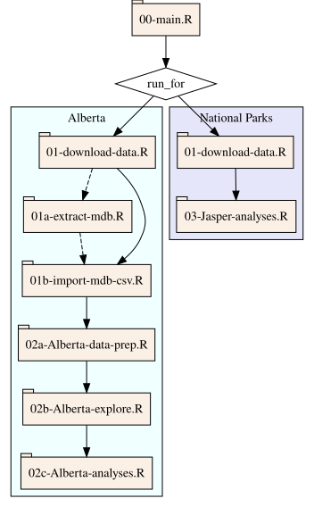

# Alberta mountain pine beetle r values

| **Code** | **Data (Alberta)** | **Data (national parks)** |
| -------- | ------------- | ------------------------- |
| [](https://doi.org/10.5281/zenodo.18023491) | [](https://doi.org/10.5061/dryad.kprr4xhk6) | [](https://doi.org/10.5061/dryad.np5hqc07k) |

## Background

Code for data retrieval and analyses of Alberta mountain pine beetle population recruitment rates (r values).

In support of the following manuscripts:

-   Cooke, B. J., Chubaty, A. M., and A. L. Carroll (*submitted*) The mountain pine beetle in a marginal boreal landscape: Cross-scale collapse triggered by population removal.

-   Cooke, B. J., Brett, R., Olesinski, J., Chubaty, A. M., and A. L. Carroll (*submitted*) Weather, climate, and the rise and fall of an unprecedented outbreak of mountain pine beetle in Alberta's Mountain Parks, 1999-2023.

## Data availability

Data are retrieved from public sources, or shared via Google Drive.

Additionally, data used for analyses of the national parks are archived at [](https://doi.org/10.5061/dryad.np5hqc07k),
and those used for analyses of the provincial commercially managed forests are archived at [](https://doi.org/10.5061/dryad.kprr4xhk6).

## Initial project setup

0.  Prerequisites:

    a.  install a suitable Java Runtime Environment following instructions at <https://github.com/CWFC-CCFB/J4R/wiki#requirements>

1.  Clone the repository:

    ``` bash
    git clone https://github.com/FOR-CAST/r-values
    ```

2.  Install required packages to project library:

    ``` r
    renv::restore()
    ```

3.  Install PhantomJS:

    ``` r
    webshot::install_phantomjs()
    ```

## Running the code

Open the primary script (`00-main.R`) and run the lines sequentially.

-   select the spatial extent of the analyses by setting `run_for = "AB"` for provincial scale, or `run_for = "NP"` for running the national parks analyses;
-   setting `extract_mdb = TRUE` requires running on Windows to be able to open the Access database files;
-   setting `plot_all = TRUE` will build all plots, including intermediate ones;
-   setting `rerun_all = TRUE` will rebuild all local intermediate datasets (use carefully!);
-   running `01-download-data.R` will prompt for Google credentials to access several data sets;
-   mdb extraction is skipped gets skipped if `extract_mdb = FALSE`;
-   most of the mdb import gets skipped unless the outputs it creates are missing or `rerun_all = TRUE`;
-   sourcing `03-Jasper-analyses.R` can be done after the '01-download-data.R' script has been run (it does not need the 01a,b nor 02 scripts to have been run);



# References

Alberta Agriculture and Forestry (2020) Mountain pine beetle detection and management in Alberta. Updated January 31, 2023. <https://open.alberta.ca/dataset/1b872329-6f35-4c11-9ee8-ec35976f4631/resource/3569fff2-b385-4d5e-889f-8192e725b558/>

Cooke, B. J., Brett, R., Olesinski, J., Chubaty, A. M., and A. L. Carroll (*submitted*) Weather, climate, and the rise and fall of an unprecedented outbreak of mountain pine beetle in Alberta’s Mountain Parks, 1999-2023.

Cooke, B. J., Chubaty, A. M., and A. L. Carroll (*submitted*) The mountain pine beetle in a marginal boreal landscape: Cross-scale collapse triggered by population removal.
